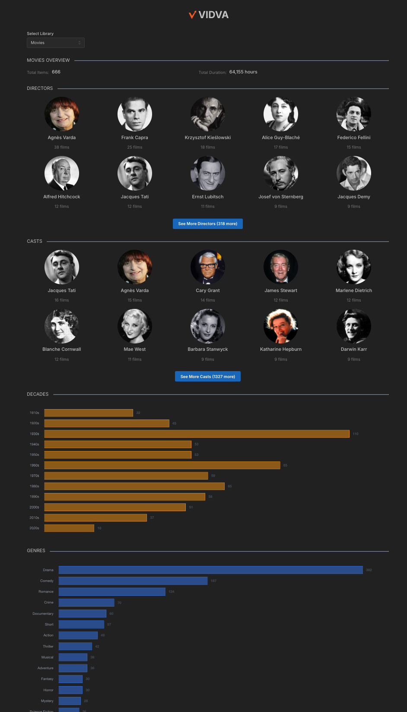

# VIDVA

A Dashboard for displaying interactive statistics about your Plex media library.



## Features

- View library statistics in real-time with interactive charts and visualizations
- Breakdowns for genres, countries, decades, directors, and cast

## Docker

| Registry   | Architecture | Version | Image Path                  |
| ---------- | ------------ | ------- | --------------------------- |
| Docker Hub | AMD64        | Latest  | `vanshady/vidva:latest`     |
| Docker Hub | ARM64        | Latest  | `vanshady/vidva:arm-latest` |

## Docker Instructions

Pass in env:

```bash
- PLEX_SERVER_URL=your_plex_server_url # http://<Your Plex's IP Address>:32400
- PLEX_TOKEN=your_plex_token # https://support.plex.tv/articles/204059436-finding-an-authentication-token-x-plex-token/
- PLEX_SERVER_ID=your_plex_server_id # Go to <PLEX_SERVER_URL>/identity and copy the server ID from machineIdentifier=
```

Bind port 5173 and voila!

## Prerequisites

- Node.js (v18 or higher)
- npm or yarn
- A running Plex Media Server
- Plex API token

## Getting Started

1. Clone the repository:

```bash
git clone https://github.com/yourusername/vidva.git
cd vidva
```

2. Install dependencies:

```bash
npm install
```

3. Configure your Plex server:

Create a `.env` file in the root directory with:

```bash
PLEX_SERVER_URL=your_plex_server_url
PLEX_TOKEN=your_plex_token
PLEX_SERVER_ID=your_plex_server_id
```

4. Start the development server:

```bash
npm run dev
```

5. Open your browser and navigate to `http://localhost:5173`

## Project Structure

```text
src/
├── components/
│   ├── layout/
│   ├── stats/
│   └── common/
├── pages/
├── services/
├── types/
├── utils/
└── assets/
```

## Technologies Used

- React 18
- Vite
- TypeScript
- Mantine UI
- Chart.js
- React Query
- Plex API

## License

This project is licensed under the MIT License - see the [LICENSE](LICENSE) file for details.
